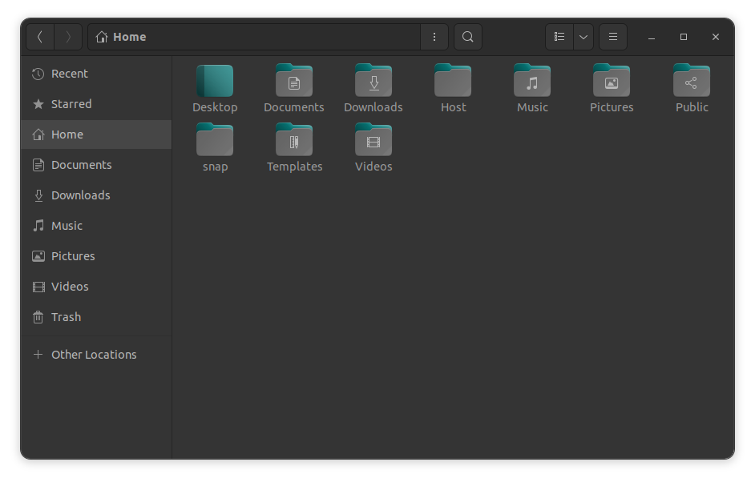

# Yaru-chromatizer
Easily change the accent color and recolor Ubuntu's Yaru theme.

Yaru-chromatizer is a script designed to customize and build the Ubuntu Yaru
theme with your chosen accent color. This project allows users to easily modify
the accent colors of the Yaru theme, generating a personalized theme and icon
set for their desktop environment.

## Compatibility
Yaru-chromatizer is tested on **Ubuntu 22.04 LTS**. More testing is needed to
ensure compatibility with other versions of Ubuntu.

The script should work on other Linux distros that use the GNOME desktop
environment. However, it is not guaranteed to work on all systems, and slight
adjustments may be necessary.

## Usage
To use Yaru-chromatizer, you need to clone the repository and run the script.
Open a terminal and run the following commands:

```bash
git clone https://github.com/dimitrios-git/yaru-chromatizer.git
cd yaru-chromatizer
./yaru-chromatizer.sh
```

Follow the instructions and choose your desired accent color. The script will
then generate the theme and icon set for your chosen color.

### Enable the new theme
After running the script and following the steps successfully, the new theme
and icon set will be generated in the `~/.local/share/themes` and
`~/.local/share/icons` directories, respectively.

For demonstration purposes, you may also install:
```bash
sudo apt install gnome-tweaks
sudo apt install gnome-shell-extension-manager
sudo apt install gtk-3-examples
```

To enable the new theme for the GNOME shell, you need to install the GNOME
Tweaks application and the GNOME Shell Extension Manager. You can install these
using the above commands.

Open the GNOME Extension Manager and enable the User Themes extension. Then,
open the GNOME Tweaks application and navigate to the Appearance tab. You can
now select the new theme and icon set from the drop-down menus.

## Screenshots





## License
The Yaru-chromatizer script is released under the MIT License. However, please
note that the Yaru theme, which this script modifies, is subject to its own
licensing terms.

The Yaru theme has mixed licenses for its components, including but not limited
to, GNU General Public License (GPL) and Creative Commons
Attribution-ShareAlike (CC BY-SA). Users are responsible for complying with the
terms of these licenses when using and distributing the modified Yaru theme.

## Credits
This project is built upon the Yaru theme by the Ubuntu team. I extend my
gratitude to the Yaru contributors for providing a robust and beautiful theme as
a foundation for this customization script.

The Yaru theme itself is an integral part of the Ubuntu desktop experience,
known for its aesthetic appeal and usability. More information about the Yaru
theme can be found at their official GitHub repository:
[ubuntu](https://github.com/ubuntu)/[yaru](https://github.com/ubuntu/yaru).
